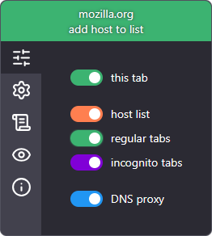
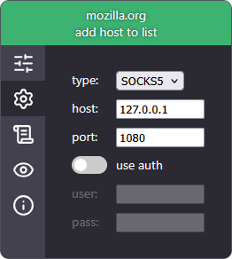
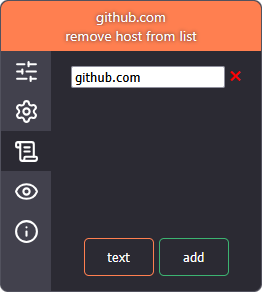
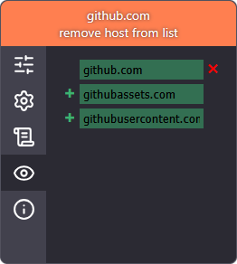

# EasyProxy

Simple proxy switcher for Firefox and Chrome.
Firefox for Android support.

Support proxy: HTTP, HTTPS, SOCKS4, SOCKS5.
- Tab proxy (regular, incognito)
- Host list proxy (subdomain support)
- DNS proxy (SOCKS4, SOCKS5) (Firefox only)
- Proxy authorization
- Host tracker
# Thank you
| USDT (TRC20 / TRON) | BTC |
| :---: | :---: |
| `TKZRfWr1Rn7srejPDGQmaCocL7b7cQHc8z` | `bc1q6fuzzqzf74gl27d95xtr2gz2p3ztm4pmk49wtt` |
|  |  |